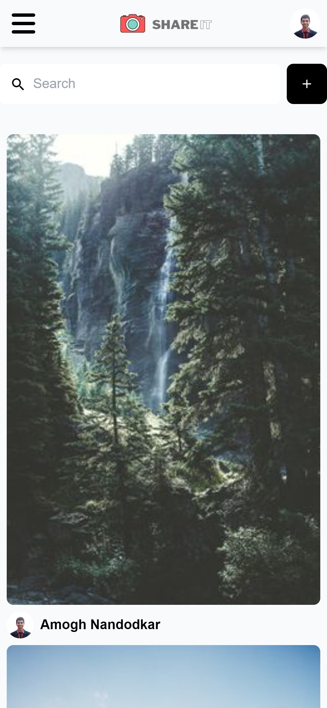

# ShareIt

## Table of contents

- [Overview](#overview)
  - [Demo](#demo)
  - [Screenshot](#screenshot)
    - [Desktop](#desktop)
    - [Mobile](#mobile)
  - [Links](#links)
- [My process](#my-process)
  - [Built with](#built-with)
  - [What I learned](#what-i-learned)
- [Author](#author) 


## Overview
With all advanced social media features, such as Google Authentication, create, edit, delete and save posts, like and comment on other people's posts, search and filter images and much more, ShareIt is an Image Sharing Social Media App .Sanity.io manages text, images, and all other data using APIs.
### Demo


### Screenshots

#### Desktop


#### Mobile




### Links

- Solution URL: [https://github.com/NandodkarAmogh/ShareIt](https://github.com/NandodkarAmogh/ShareIt)
- Live Site URL: [https://shareitsocial.netlify.app/](https://shareitsocial.netlify.app/)

## My process

### Built with

- Mobile-first workflow
- [React](https://reactjs.org/) - JS library
- [React Router](https://reactrouter.com/) 
- [Sanity.io](https://www.sanity.io/)
- [Tailwind CSS](https://tailwindcss.com/) - For styles
### What I learned

This is my first project in which I worked with Sanity. This project helped me in revising some of the core react concepts like react router and hooks like useState and useEffect. Through this project I also learned to write sanity queries 

```react

    export const userQuery = (userId) => {
    const query = `*[_type == "user" && _id == '${userId}']`;

    return query
    };

    export const userCreatedPinsQuery = (userId) => {
    const query = `*[ _type == 'pin' && userId == '${userId}'] | order(_createdAt desc){
        image{
        asset->{
            url
        }
        },
        _id,
        destination,
        postedBy->{
        _id,
        userName,
        image
        },
        save[]{
        postedBy->{
            _id,
            userName,
            image
        },
        },
    }`;
    return query;
    };
```
## Author

- Github - [@NandodkarAmogh](https://github.com/NandodkarAmogh)


